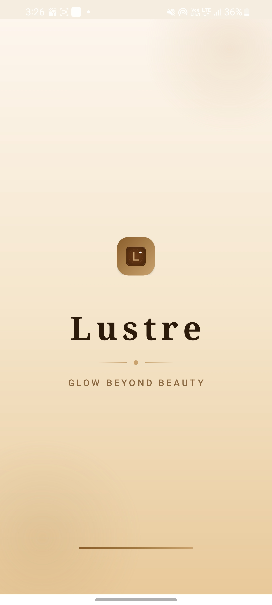
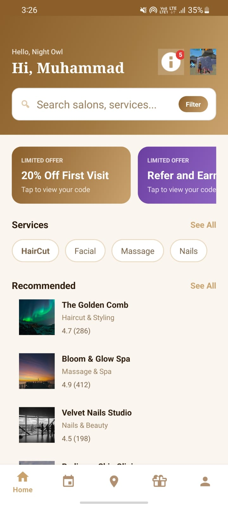
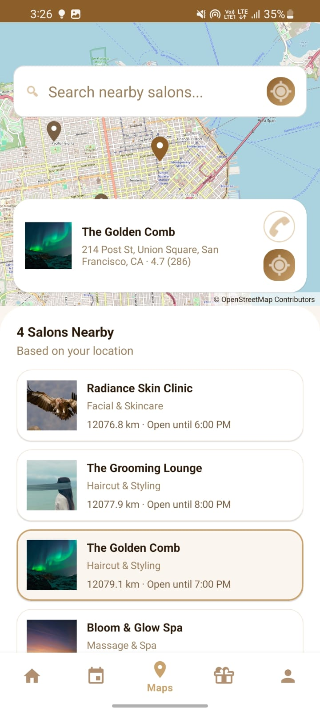
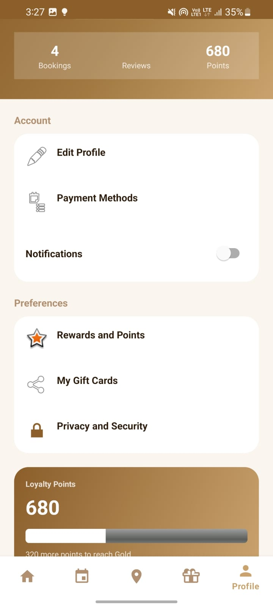
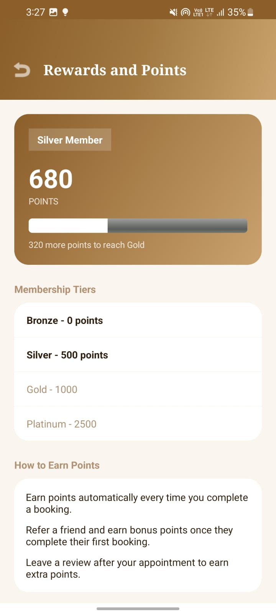
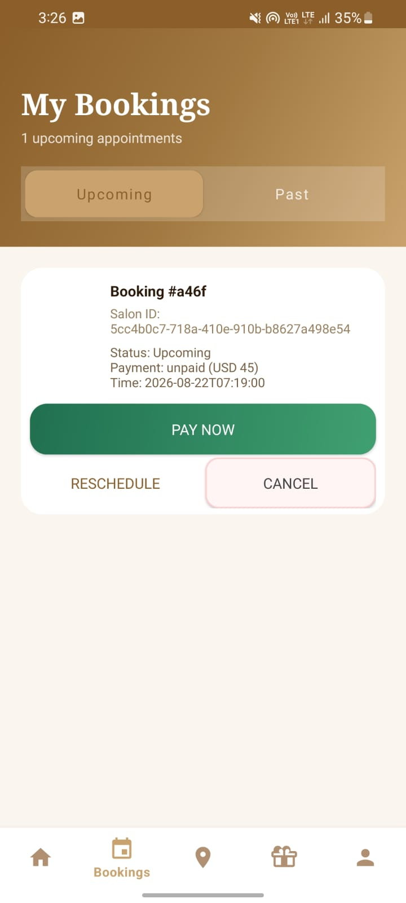

# Lustre
Lustre is a salon booking app where users can create an account, find salons, book a service with stylists listed on the salons so they can save time rather than manually booking or waiting at the salon. This app is only the customer side not the salon people, that is not developed yet. The users can update profile, get vouchers, gift cards.
## Motivation
I mostly do web development with react and fastapi and I got curious about how apps and work and as a part of my college work I was assigned to make a small project on figma. I designed this simple salon booking app layout with 3 or 4 pages and forgot about it. So I wanted to learn about android development more importantly app development so I took that design, as figma import has an option so I got the initial design as code but then I iterated on it like there were 3 or 4 files of xml layouts, I worked on those with the help of AI, made those functional and learnt alot of things. Then I went deep into it and worked on my own to create functionalities of new screens, features. I got to learn about firebase messaging, oauth in apps, sha hashes, and kotlin and android development stuff of course. Like I created the project using two techniques fragments and separate activities as to learn both. I knew most about fastapi backend so that was not an issue.
### Tech Stack
This project uses FastAPI as backend server hosted on nest, url https://yappyyap.xyz/lustre/ . For the database and its operations, SqlAlchemy ORM in Python with Postgres as main db are used. The main application is written in kotlin with xml layouts. Firebase messaging for push notifications, jwt tokens, retrofit on the application side for request handlings( I also learnt that)
## Features
- The user can signup using their email and password, email is confirmed by otp.
- The user signs in using the password and email setted during sign up. They can also reset their password by email if they forgot.
- The user can sign in/up using google oauth.
- The user can book a service with stylist.
- The user can change and setup their avatar photo, phone no, date of birth
- The user can spend their vouchers and gift cards.
- A sign up voucher of discount is given to every user.
- The user can also change their password using their old password from privacy and security on profile page
- The user can submit tickets for help, and view also
- The user can logout and delete their account
- The user can reschedule their booking
- The user can use maps to see salons's positions
- The user can cancel bookings
- The user can enable and disable notifications. If enabled they will receive notifications.
### Features that are created but due to absence of salon managing apps do not work as intended:
- The user can pay and submit an image of payment to the salon. But as their is no salon app, so no one marks it paid, but it is stored on server and shows to user as pending verification
- The user can send gift cards, and receive but the payment confirming is not done of gift card.
- The rewards also needs a salon app to mark booking and reward user booking payments so they are in hold too.
### Not Implemented
- The profile settings show booking notifications but that does not do anything
- The dark mode also does not works.
- The payment methods is a dummy section, it does not do anything.
## How to Install
Head over to releases. Install the apk file from there. When installed open it, it will show options of application not play protected or verified, click on more options and then install anyways. Some devices ask for scanning, but if it does go with scanning and then install afterwards. You can open the app and try it.
### Test Accounts
Password for all test accounts = ```Test@1234```
Emails
```
sarah.khan@example.com
hamza.tariq@example.com
```
## For making changes and tweaking for your own self:
If you are some one looking to deploy it and make changes related to backend or application. They can open a new project by using the repo's url. Sync gradle and run it.
For the backend, you need to go to backend's folder, and run the project using uvicorn python. Use the command: 
```uvicorn main:app --host 0.0.0.0 --port 8000```
You can then access the hosted backend in android studio if on the same device from "http://10.0.2.2/lustre/".
## Usage of AI
AI assisted me, not made with AI.
When I first imported my figma project, I had no information about android development so I took help of AI to translate themes, fonts, and help in kotlin code. But that was 3 or 4 pages that too I believe are completely over written by me now. So ai help was used there,debugging, writing firebase backend token pushing code that you can copy from its docs but I did not want to search so.. . The dummy data inserted was all by the help of AI. Other than that everything was created without any AI usage. 

## Images






